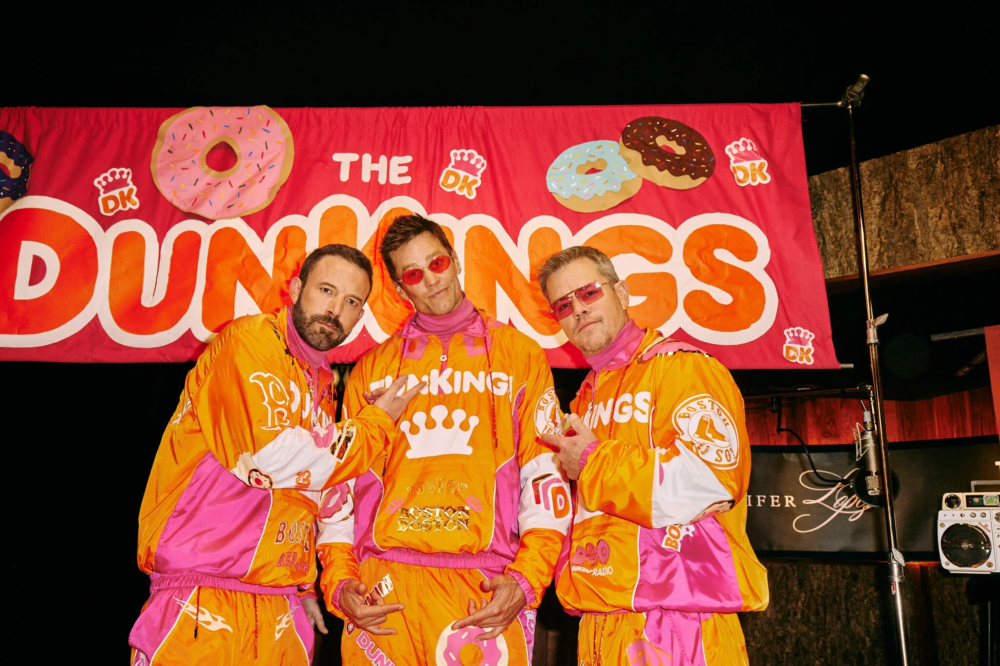

```{r global_options, echo=FALSE}
knitr::opts_chunk$set(echo = TRUE)

#needed packages:
library(ggplot2)
library(kableExtra)
```

```{r, echo=FALSE}
supad <- read.csv('Project1_SuperBowlAds.csv')
ad_ggplot <- ggplot(supad)
```

# **What Influences the Likes a Super Bowl Ad Gets?**

The data was collected from [FiveThirtyEight](https://projects.fivethirtyeight.com/super-bowl-ads/), and they mentioned that the initial source for their data was [superbowl-ads.com](https://www.superbowl-ads.com/). FiveThirtyEight analyzed ads and them grouped them based on having similar criteria. They watched 233 ads from 10 brands that aired the most spots in all the Super Bowls, and evaluating every criteria spot as "yes" or "no". The outcome variable is the proportions of likes each Super Bowl ad received. The predictors we will be investigating the comment count, how patriotic the ad was, and whether the add used sex.

```{r, echo=FALSE}

```

“The Best Super Bowl 2024 Commercials.” Boston.Com, The Boston Globe, 12 Feb. 2024, www.boston.com/culture/entertainment/2024/02/12/best-super-bowl-2024-commercials/.

### The Proportion of Likes a Super Bowl Ad Receives {style="color:blue"}

```{r, echo=FALSE}
supad$proplike <- ((supad$like_count/supad$view_count)*100)
```

The distribution of the percentage of likes out of total views each Super Bowl received is skewed right with an IQR of `r IQR(supad$proplike, na.rm=TRUE)`. The median percentage of likes out of total views each Super Bowl received is `r median(supad$proplike, na.rm=TRUE)`.

```{r, echo=FALSE, warning=FALSE}
ad_ggplot <- ggplot(supad)
ad_ggplot + geom_histogram(aes(x=proplike), binwidth = 0.05, col='black', fill='blue') + labs(title="Distribution of Likes Each SuperBowl Ad Received", x='Percentage of Likes out of Total Views',y='Count')
```

```{r, echo=FALSE}
suppat <- supad[supad$patriotic=='TRUE',]
nosuppat <- supad[supad$patriotic=='FALSE',]
```

### The Proportion of Likes a Super Bowl Ad Receives and Whether it's Patriotic {style="color:green"}

The distribution of the percentage of likes for each ad seems similar for both ads that were patriotic and those that weren't. Both distributions are skewed right. The IQR for the distribution of the percentage of likes for each ad that was patriotic was `r IQR(suppat$proplike, na.rm=TRUE)`,and for the distribution of the percentage of likes for each ad that wasn't patriotic it was `r IQR(nosuppat$proplike, na.rm=TRUE)`. The median for the distribution of the percentage of likes for each ad that was patriotic was`r median(suppat$proplike, na.rm=TRUE)`, and the median of the distribution of the percentage of likes for each ad that wasn't patriotic it was`r median(nosuppat$proplike, na.rm=TRUE)`. They have similar medians and IQR's, therefore it does not appear whether or not he ad was patriotic affected the percentage of likes it got. If you'd like to learn more about patriotic ads in America [click here](https://businessjournalism.org/2024/07/patriotic-marketing/).

```{r, echo=FALSE, warning=FALSE}

ad_ggplot + geom_histogram(aes(x=proplike), binwidth = 0.05, col='black', fill='darkgreen') + labs(title="Distribution of Likes for Each Super Bowl Ad and Whether the Ad was Patriotic", x='percentage of Likes out of total views',y='count') + facet_wrap(~patriotic)
```

### The Proportion of Likes a Super Bowl Ad Receives and the Ads Comment Count {style="color:red"}

With a correlation coefficient of `r cor(supad$comment_count, supad$proplike, use = "complete.obs")`, there appears to be no linear association between the number of comments a Super Bowl ad received and the percentage of likes it received.

```{r, echo=FALSE, warning=FALSE}
ad_ggplot + geom_point(aes(x=comment_count,y=proplike),color='darkred') + labs(title="The Percentage of Likes According to The Number of Comments Each Ad Received", x='Number of Comments',y='Percentage of Likes Out of Total Views')
```

```{r, echo=FALSE}
sex<- supad[supad$use_sex=='TRUE',]
nosex<- supad[supad$use_sex=='FALSE',]
```

### The Proportion of Likes a Super Bowl Ad Receives and Whether the Ad used Sex {style="color:purple"}

The distribution of the percentage of likes for each ad seems similar for both ads that used sex and those that didn't. Both distributions are skewed right. The IQR for the distribution of the percentage of likes for each ad that used sex was `r IQR(sex$proplike, na.rm=TRUE)`,and for the distribution of the percentage of likes for each ad that didn't use sex was `r IQR(nosex$proplike, na.rm=TRUE)`. The median for the distribution of the percentage of likes for each ad that used sex was `r median(sex$proplike, na.rm=TRUE)`, and the median of the distribution of the percentage of likes for each ad that didn't use sex was `r median(nosex$proplike, na.rm=TRUE)`. They have similar medians and IQR's, therefore it does not appear whether or not he ad used sex affected the percentage of likes it got. You can learn more about the ethics of using sex in advertising [here](https://heinonline.org/HOL/Page?handle=hein.journals/jnlolletl9&div=15&g_sent=1&casa_token=&collection=journals).

```{r, echo=FALSE}
 boxplot(supad$proplike~supad$use_sex, main='The Likes Received for Each Ad According to Whether it Used Sex',ylab='Used Sex',xlab='Percentage of Likes received out of Total views',names=c("Used Sex", "Didn't use Sex"),col=c('#0571b0','#ca0020'), horizontal = TRUE)
```

### Conclusion

Through this investigation I have found that patriotic elements, elements or sex, and the number of comments do not affect the number of likes a Super Bowl Ad receives. For future research we could investigate if the use of certain words boosts the like of ads, and if certain backgrounds affects the number of likes an ad receives.

#### References

“According to Super Bowl Ads, Americans Love America, Animals and Sex.” *FiveThirtyEight*, FiveThirtyEight, 4 Feb. 2021, projects.fivethirtyeight.com/super-bowl-ads/.

Rfordatascience. “Tidytuesday/Data/2021/2021-03-02 at 2e9bd5a67e09b14d01f616b00f7f7e0931515d24 · Rfordatascience/Tidytuesday.” *GitHub*, github.com/rfordatascience/tidytuesday/tree/2e9bd5a67e09b14d01f616b00f7f7e0931515d24/data/2021/2021 -03-02. Accessed 26 Sept. 2024.

“Superbowl-Ads.com Video Archive.” *Superbowl-Ads.com Video Archive*, www.superbowl-ads.com/.
